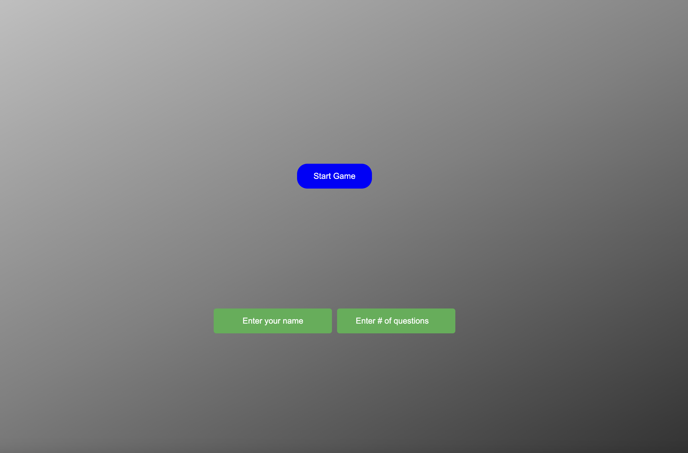
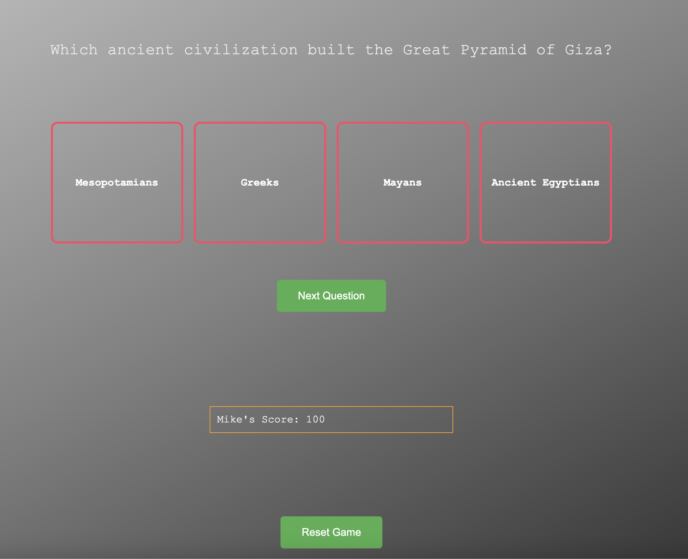
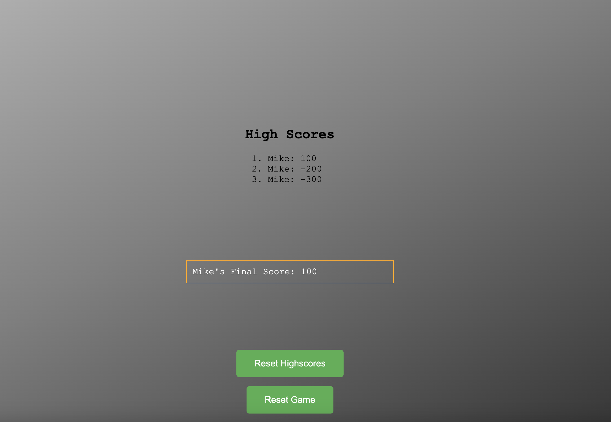

☐ Title: History Trivia

☐ Screenshot(s): 
Start Screen:

Questions:

High Score Screen:

☐ Technologies Used: HTML, CSS, Javascript, JSON

☐ Getting Started: https://thriving-sfogliatella-d0b989.netlify.app/

To play the game, start by inputting your name and how many questions you would like in your quiz. 

After clicking start, the questions will display with four options, choose the option you believe is correct and continue doing so until the quiz question set is finished. 

At the end, the current High Score List will appear and your score will appear. If your quiz score is higher then the top 10, it will be added to the scoreboard for future games. 

If you would like to play the game again, simply click the Reset Game button to return to the beginning.

☐ Next Steps: I would like to improve the visual appearance of the game at a later date. Also would like to add categories to the quiz so that there is more then just history questions available. Possibly would also like to add a difficulty functionality that will enable the player to choose how difficult the questions displayed will be.
